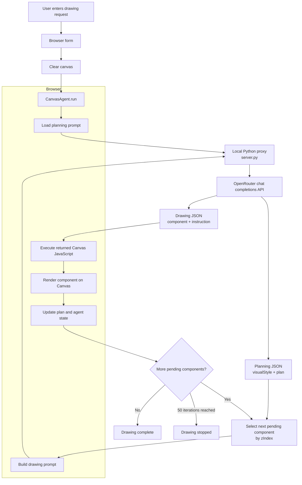

# Canvas AI

Canvas AI is a small study project about agent ecosystem and harness concepts. It uses a simple browser-based drawing example to explore how an agent can plan work, maintain state, call a model, execute tools, and iterate toward a result.

This is intentionally a lightweight educational prototype, not a robust agent framework or production-ready drawing application. The goal is to make the core ideas easy to see in a compact codebase rather than to provide a complete harness implementation.

The example turns a natural-language request into an HTML Canvas illustration using a two-stage LLM workflow:

1. Create a structured drawing plan.
2. Implement each planned component as executable Canvas 2D JavaScript.

The browser renders components from back to front and progressively draws each component on the canvas.

## Study Scope

The project demonstrates a few basic harness patterns:

- **Planning:** an initial model call decomposes a request into ordered components.
- **State:** the agent tracks pending and completed components across iterations.
- **Context passing:** each drawing call receives the plan, visual style, current state, and active component.
- **Tool execution:** the agent executes model-produced Canvas instructions through the browser context.
- **Progress tracking:** the agent logs completed components and stops when the plan is complete or the interaction limit is reached.

The implementation deliberately leaves out the infrastructure expected from a mature agent system, such as durable state, retries, tracing, evaluation, permissions, structured tool APIs, authentication, and robust error recovery.

## How It Works

When the form is submitted:

1. `script.js` clears the canvas and calls `CanvasAgent.run()`.
2. `agent.js` loads `planningPrompt.md` and replaces its placeholders with the request and canvas dimensions.
3. The planning request is sent to OpenRouter through the local Python proxy.
4. The response must contain a `visualStyle` object and a non-empty `plan` array.
5. Planned components are processed in ascending `zIndex` order.
6. For each component, `drawingPrompt.md` is filled with the request, style, plan, current state, and active component.
7. The model returns the component name, a message, and executable JavaScript.
8. The JavaScript receives the Canvas 2D context as `ctx` and is executed.
9. The component is marked complete before the next component is processed.

The agent stops after all components are complete or after `MAX_INTERACTIONS` iterations, currently `50`.

## Flow

The complete request flow is intentionally simple: the browser owns the agent loop and canvas state, while the local Python server only forwards model requests to OpenRouter.

The planning call happens once. The drawing call repeats once per planned component, with the current plan and agent state passed back into the prompt on every iteration.

