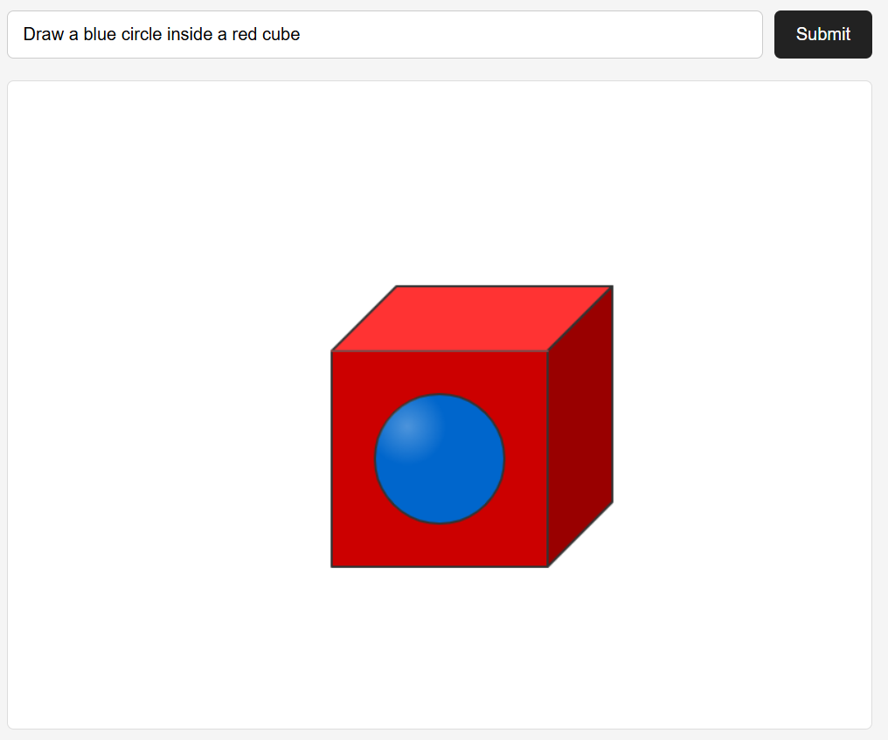
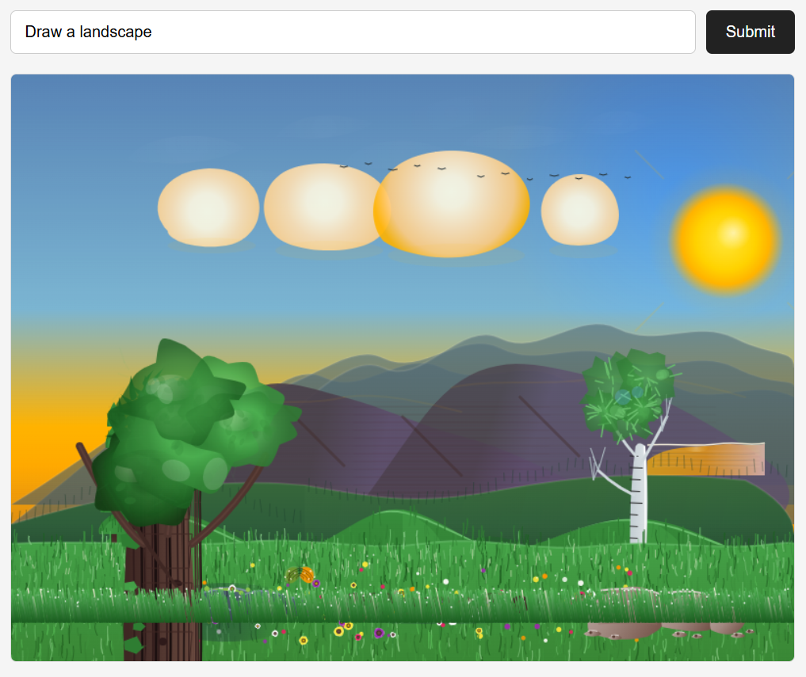
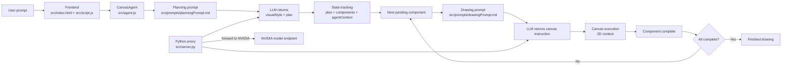

# Canvas AI

A lightweight experiment in browser-based agent orchestration: a small HTML canvas app that asks an LLM to plan a drawing, break it into components, and then iteratively render each part while keeping structured state across steps.

<p align="center">
  
  
</p>

## What this project is

This project is not trying to be a polished image generator or a production-ready design system. The point is to explore the harness itself: an agentic loop built from planning, state, tool execution, and multi-step iteration.

In practice, the app demonstrates:

- a planning stage that turns a user request into a list of drawing components
- a runtime state object that tracks which parts are complete, pending, and remaining
- LLM calls that produce structured JSON instead of free-form text
- code generation for canvas drawing instructions
- execution of those instructions directly on the canvas 2D context
- repeated passes until a full plan is satisfied or the loop stops

The result is more like a compact experimental harness than a fine art renderer.

## Why this exists

The goal is to make the underlying agent architecture easy to reason about in a small, readable codebase.

This is intentionally a study project for:

- agent loops and task decomposition
- memory/state tracking between steps
- tool-driven execution inside a browser
- prompt engineering and structured responses
- the difficulty of getting reliable visual output from an LLM when rendering constraints are strict

The emphasis is on the structure of the loop and the execution model, not on full visual quality.

## High-level architecture



## Flow process

The runtime loop follows this sequence.

1. The browser loads the page and starts a `CanvasAgent` attached to the canvas.
2. The user submits a prompt such as "Draw a blue circle inside a red cube".
3. `buildPlanningPrompt()` loads the planning template from the prompt file and injects the user request plus canvas size.
4. `callLLM()` sends the prompt to the local Python proxy server, which forwards it to the NVIDIA API.
5. The model returns JSON with:
   - `visualStyle`
   - a prioritized `plan` array of components
6. `createDrawingPlan()` normalizes that response into a working state object.
7. The agent repeatedly selects the next pending component by `zIndex` order.
8. For each component, it builds a drawing prompt containing:
   - the original user request
   - the global visual style
   - the full plan
   - the current state
   - the specific component to render
9. The model returns a JSON payload containing:
   - the exact component name
   - a short message
   - an `instruction` string that is raw JavaScript canvas commands
10. `executeInstructions()` creates a function body from that code and runs it on the canvas context.
11. If execution succeeds, the component is marked complete and the state is updated.
12. The loop continues until all components are done or the interaction cap is reached.

## Main components

### Browser frontend

- [src/index.html](src/index.html) sets up the form and canvas.
- [src/script.js](src/script.js) wires the input form to the agent and clears the canvas before each new request.
- [src/styles.css](src/styles.css) contains the UI styling for the prompt bar and canvas region.

### Agent loop

- [src/agent.js](src/agent.js) is the core harness.
- It handles:
  - prompt loading
  - prompt construction
  - LLM calls
  - JSON parsing and recovery
  - planning and component scheduling
  - state tracking
  - instruction execution on the canvas

Important implementation details from the current code:

- `MAX_INTERACTIONS` is set to 5, but the code allows a higher effective bound based on the number of planned components.
- The loop continues while not all plan items are marked `complete`.
- It sorts pending work by `zIndex` to get back-to-front composition order.
- Generated drawing instructions are executed with a `Function` that wraps them in an async execution block.

### Prompt layer

- [src/prompts/planningPrompt.md](src/prompts/planningPrompt.md) tells the model to produce a structured plan with `visualStyle` and a component list.
- [src/prompts/drawingPrompt.md](src/prompts/drawingPrompt.md) focuses on a single component and instructs the model to return raw JavaScript canvas calls.

### Proxy server

- [src/server.py](src/server.py) is a lightweight HTTP bridge.
- It receives JSON payloads from the browser and forwards them to the NVIDIA API endpoint.
- It also sets CORS headers so the browser can call this local endpoint without friction.

## How it works in practice

The harness is intentionally simple:

- the model is asked to think in structured JSON
- the app stores state as plain JS objects
- each cycle solves one component at a time
- the canvas is mutated as each instruction executes

Because of that, the quality of the final image depends heavily on:

- how well the planner decomposes the scene
- how detailed the provided state is
- how precise the prompt instructions are
- the actual LLM behavior at each step
- whether the model produces valid canvas JavaScript without drifting off task

This means the system can create convincing examples, but it is not deterministic and can fail gracefully or partially.

## Running the project

1. Start the local proxy server:

```bash
cd src
python server.py
```

2. Open the app in a browser using a local static server or by opening the page in a simple dev server.

3. Enter a prompt and submit it.

The browser will call `http://127.0.0.1:8000` and the Python server will relay the request to NVIDIA.

## Current limitations

- prompts can be brittle and depend strongly on the exact wording supplied to the model
- the planner may produce incomplete or weak decompositions for complex scenes
- drawing instructions are sometimes valid but not visually ideal
- state tracking is intentionally minimal and does not include deep validation or rollback
- errors are logged but the system does not yet include a sophisticated recovery or self-correction loop
