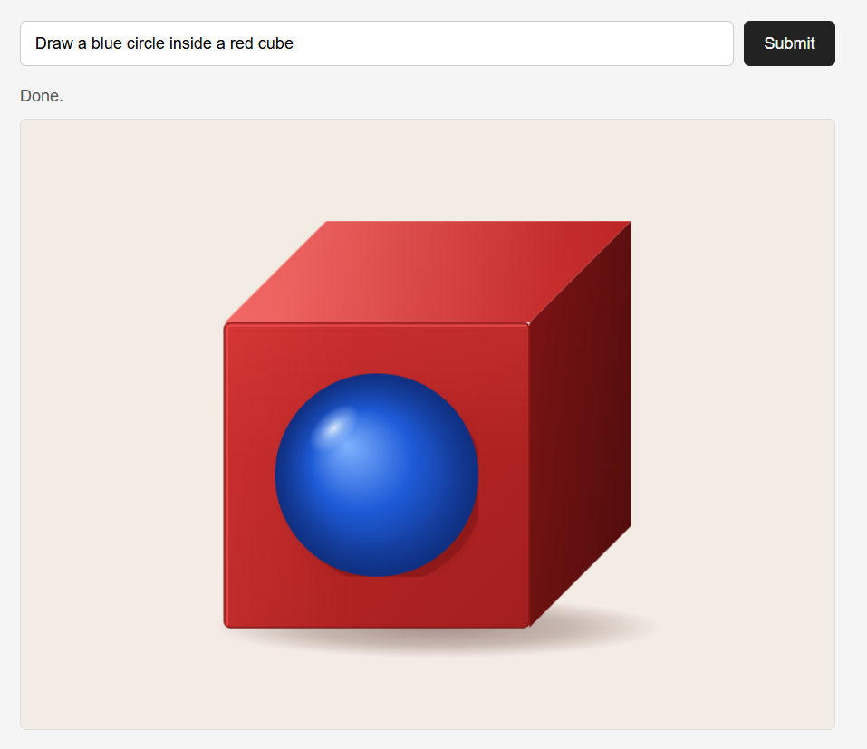
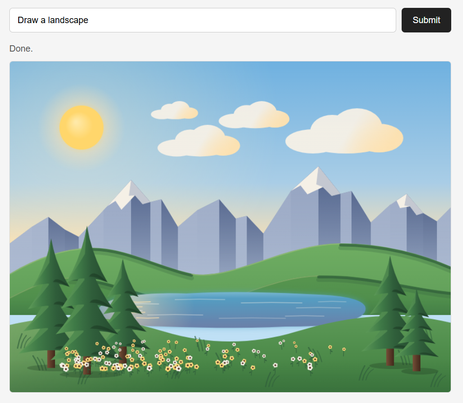
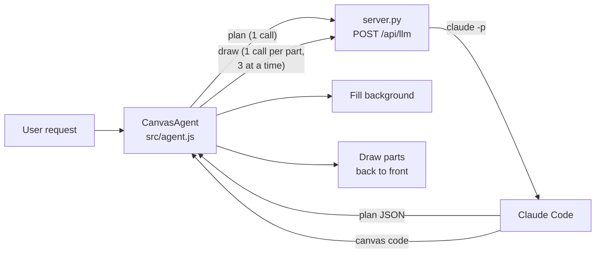

# Canvas AI

A small experiment in agent orchestration: describe a picture, and an LLM plans it as a list of parts, writes HTML Canvas code for each part, and the browser draws them back to front.

<p align="center">
  
  
</p>

## What this project is

This isn't a polished image generator. The point is the harness: a small, readable agent loop that shows

- **task decomposition**: one planning call turns a request into a list of self-contained parts;
- **structured output**: the plan comes back as compact JSON with positions, colors and descriptions;
- **code generation as a tool**: each part comes back as Canvas 2D JavaScript that the browser runs;
- **orchestration**: parts are requested in parallel but drawn strictly in back-to-front order;
- **recovery**: syntax errors are retried with the error message, and a failed part is skipped instead of stopping the drawing;
- **cost awareness**: short prompts, raw-code responses and per-call token logging.

It runs on the Claude Code CLI, so it uses your Claude Pro or Max subscription. No API key is needed.

## How it works


```mermaid
flowchart LR
    U[User request] --> A["CanvasAgent<br/>src/agent.js"]
    A -->|"plan (1 call)"| S["server.py<br/>POST /api/llm"]
    S -->|claude -p| C[Claude Code]
    C -->|"plan JSON"| A
    A --> B[Fill background]
    A -->|"draw (1 call per part,<br/>3 at a time)"| S
    C -->|"canvas code"| A
    A --> D["Draw parts<br/>back to front"]
```

1. **Plan.** The agent sends the request and the canvas size. The model returns JSON like this:
   ```json
   {
     "background": "#f3ede4",
     "palette": ["#c62828", "#8e1414", "#1e5bd8", "#8fb8ff", "#fff6ee"],
     "light": "top-left",
     "parts": [
       { "name": "floor_shadow", "box": [230, 440, 380, 70], "desc": "Soft elliptical shadow..." },
       { "name": "blue_sphere",  "box": [300, 200, 170, 170], "desc": "Blue ball centered at (385,285), radius 85, radial gradient #8fb8ff to #1e5bd8..." }
     ]
   }
   ```
   Parts are listed back to front. `box` is `[x, y, width, height]` in canvas pixels, and `desc` holds everything needed to draw that part on its own: shape, technique, exact colors, and how it connects to its neighbours.
2. **Background.** The agent fills the canvas with `background` itself, without an LLM call.
3. **Draw requests.** For each part, the agent sends a four-line prompt, up to 3 at a time:
   ```
   Picture: Draw a blue circle inside a red cube
   Canvas: 800x600, light: top-left, palette: #c62828,#8e1414,...
   Other parts: floor_shadow [230,440,380,70]; cube_back_faces [240,110,320,340]; ...
   Draw "blue_sphere" in box [300,200,170,170]: Blue ball centered at (385,285)...
   ```
   The model replies with plain JavaScript (not JSON) that draws only that part. If the code has a syntax error, the agent asks once more and includes the error message.
4. **Draw.** As the code arrives, parts are drawn in plan order. Each part runs between `ctx.save()` and `ctx.restore()`, so its colors, transparency or shadows can't leak into the next part. If a part fails, it's skipped and named in the status line.
